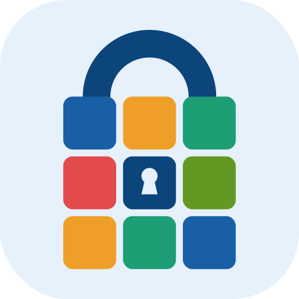

<p align="center">
  
</p>

# Scrambles Viewer

A mobile app for viewing WCA scramble PDFs at a competition. Pick a competition,
load the TNoodle scrambles ZIP, and every PDF is matched to its round and scramble
set and laid out in schedule order — so the next set to scramble is always the next
one in the list.

Built with Expo (React Native) for Android and iOS.

## Features

- **Competition search** — search the [WCA API](https://www.worldcubeassociation.org/api/v0)
  and load a competition's public WCIF.
- **Schedule-ordered set list** — rounds are ordered by their scheduled start time,
  grouped by round, and expanded into one entry per scramble set. Fewest Moves and
  Multi-Blind rounds get one entry per attempt per set.
- **ZIP import** — pick the TNoodle scrambles ZIP; the PDFs inside are matched to the
  schedule by filename and extracted to app storage. The app reports how many of the
  PDFs it matched.
- **Password-protected viewing** — each set's PDF password is prompted for on open.
  Passwords are held in memory only and cleared when the viewer is closed; they are
  never written to disk.
- **Sets re-lock after 30 minutes** — moving to another set closes the one you left and
  starts its lock timer. Come back within 30 minutes and it is still open; come back
  later and the password is required again. The timer only runs while a set is closed,
  and it restarts each time you leave the set, so a set you keep returning to does not
  silently stay unlocked all day.
- **Viewer built for the venue** — swipe between sets, landscape support, and the PDF
  opens zoomed in so scrambles are readable at arm's length.
- **Offline after import** — the WCIF, the set list, and the extracted PDFs are stored
  locally, so the app works without a connection once the ZIP is loaded. `Sync` refetches
  the WCIF when the schedule changes.

## Getting started

Requires Node.js 20+ and the Expo tooling.

```bash
npm install
npm start        # then press a / i, or scan the QR code
npm run android
npm run ios
```

The PDF viewer relies on native modules, so it does not run in Expo Go — use a
development build or one of the APKs below.

## Building

Preview APK (EAS cloud build, `preview` profile in `eas.json`):

```bash
npx eas-cli build --profile preview --platform android
```

### Releases

Publishing a GitHub release (tagged `v1.2.3`) runs `.github/workflows/release-apk.yml`:

1. reads the version from the tag and writes it to `expo.version`,
2. builds the APK on EAS and attaches it to the release,
3. commits the same version back to the default branch, so `app.json` in the repo
   always reflects the latest release.

The tag is the single source of truth for the user-facing version — you don't need to
bump `app.json` by hand before tagging. `android.versionCode` is not stored in the repo
at all: `eas.json` sets `appVersionSource: "remote"`, so EAS increments it per build.

To set the version locally anyway:

```bash
node scripts/set-app-version.js 1.2.3
```

## Project structure

```
assets/                   app icon, adaptive icon, favicon, logo (PNG + SVG source)
src/
  api/wca.ts              WCA API client (competition search, WCIF fetch)
  store/                  competition context — persistence + in-memory passwords
  navigation/             stack navigator (Home / Search / Viewer)
  screens/                HomeScreen, SearchScreen, ViewerScreen
  components/             PasswordModal
  utils/
    schedule.ts           WCIF schedule -> ordered scramble sets
    pdfMatching.ts        scramble PDF filename -> scramble set
    zipHandler.ts         ZIP picking, extraction, local PDF storage
    eventNames.ts         event ids -> display names and PDF filename spellings
    setLock.ts            when a closed set re-locks and needs its password again
scripts/
  set-app-version.js      writes expo.version into app.json (used by the release workflow)
```

## How PDF matching works

TNoodle names each PDF after the event, round, and scramble set, optionally prefixed
with the competition name:

```
<Competition> - 3x3x3 Cube Round 1 Scramble Set A.pdf
3x3x3 Multiple Blindfolded Round 1 Scramble Set A Attempt 1.pdf
```

`pdfMatching.ts` pulls the event name, round number, scramble set letter, and attempt
number out of the filename and matches them against the sets built from the WCIF. The
event name in the filename does not always match the app's display name (TNoodle writes
`3x3x3 Multiple Blindfolded`, the app shows `3x3x3 Multi-Blind`), so `eventNames.ts`
keeps the alternative spellings per event id.

If a competition's PDFs are named differently and some sets stay unmatched, that alias
list and the filename regexes are the place to look.

## License

MIT — see [LICENSE](LICENSE).
